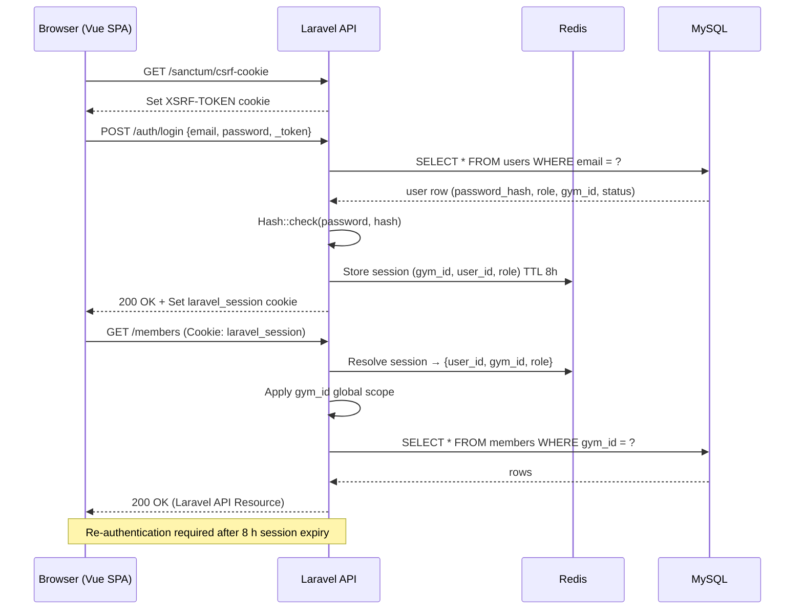
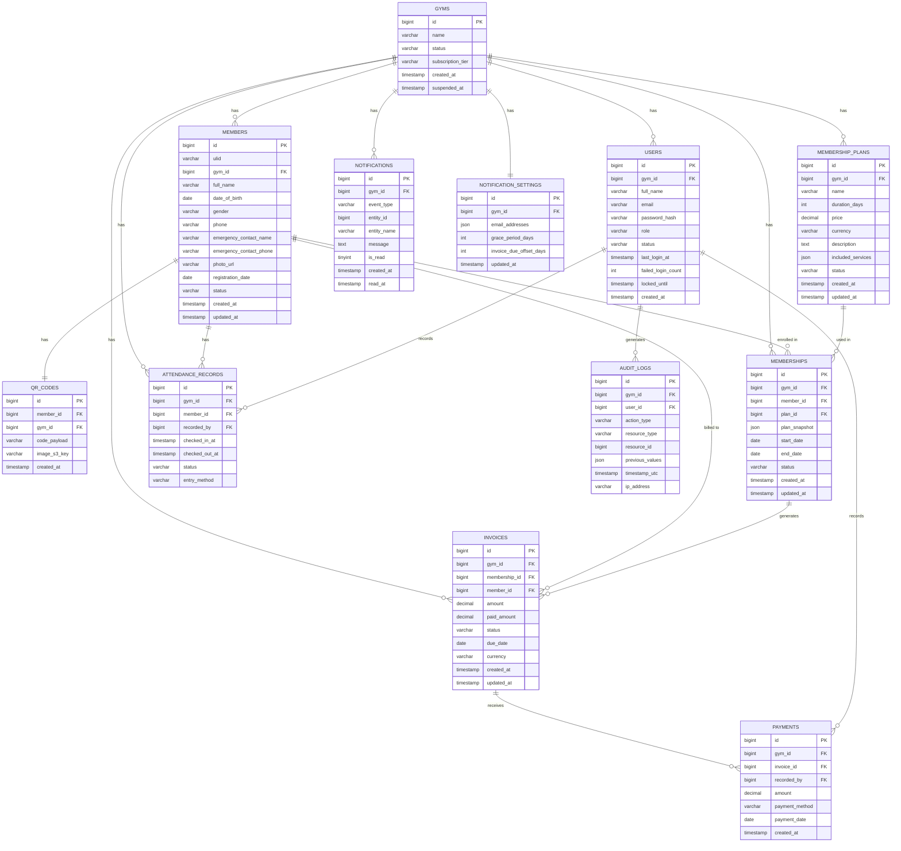

# Design Document — IronDesk Gym Management System

## Overview

IronDesk is a multi-tenant SaaS web application built for gym operators. It replaces paper-based workflows with a centralized operations platform covering member management, attendance tracking, membership lifecycle, billing, staff management, notifications, and reporting. The system is staff-facing only — members never log in.

### Design Goals

- Full tenant data isolation: no cross-tenant data leakage under any execution path
- Role-based access control (Super_Admin, Gym_Owner, Receptionist) enforced at every API layer
- Sub-2-second response times for all interactive operations under 100 concurrent users per tenant
- Stateless, horizontally scalable application tier
- Extensible data models to support future modules (mobile app, payment gateways, biometrics, SMS)

### Multi-Tenancy Architectural Principle

Even though IronDesk may start serving a single gym, every primary table carries a `gym_id` foreign key from day one. Service classes accept a `Gym $gym` parameter rather than reading tenant identity from global state. This means adding a second gym requires no schema changes — only provisioning a new row in the `gyms` table. This is the foundational architectural principle that makes IronDesk SaaS-ready without re-architecture.

### Technology Choices

| Layer | Choice | Rationale |
|---|---|---|
| Frontend | Vue 3 + TypeScript + Vite | Composition API, fast dev builds, progressive SPA framework |
| API | Laravel 12 (PHP) | Rich ecosystem, Eloquent ORM, built-in queues, scheduler, and policies |
| Database | MySQL 8.x (InnoDB) | Strong ACID guarantees, FULLTEXT search, JSON column support |
| Background Jobs | Laravel Queues + Laravel Scheduler | Native async job dispatch and cron scheduling within the framework |
| Auth | Laravel Sanctum (SPA cookie-based) | CSRF-token + session cookie, no JWT refresh-token complexity |
| ORM | Eloquent ORM | Fluent query builder, global scopes for gym_id isolation |
| Validation | Laravel Form Requests | Declarative, co-located validation with automatic 422 responses |
| Object Storage | S3-compatible (AWS S3 or MinIO) | Profile photo storage outside DB |
| Email | Laravel Mail + queue (Mailgun, SES, or SMTP) | Queued mailable jobs, driver-agnostic |
| Cache / Session | Redis (via Laravel Cache facade) | Session storage (8 h lifetime), dashboard metric cache, job queues |
| Container | Docker + Laravel Sail (local); Docker/Kubernetes or Laravel Forge (production) | Health endpoints, horizontal scaling |


---

## Architecture

### System Architecture Diagram

```mermaid
graph TB
    subgraph Client["Browser (Vue 3 SPA)"]
        UI[Vue 3 UI]
    end

    subgraph API["Application Tier (Stateless Laravel 12)"]
        GW[Laravel Router]
        SM[Sanctum Auth Middleware]
        GS[Eloquent Global Scope - gym_id]
        subgraph Modules
            MemberSvc[Member Service]
            PlanSvc[Plan Service]
            MembershipSvc[Membership Service]
            AttSvc[Attendance Service]
            BillSvc[Billing Service]
            StaffSvc[Staff Service]
            DashSvc[Dashboard Service]
            ReportSvc[Report Service]
            NotifSvc[Notification Service]
            TenantSvc[Gym/Tenant Service]
        end
        subgraph Policies
            GymPolicy[GymPolicy]
            MemberPolicy[MemberPolicy]
            StaffPolicy[StaffPolicy]
            BillingPolicy[BillingPolicy]
        end
    end

    subgraph Async["Background Workers (Laravel Queue + Scheduler)"]
        ReconcileJob[MembershipReconcileJob]
        NotifJob[NotificationDispatchJob]
        EmailJob[SendMailJob]
        InvoiceJob[InvoiceOverdueJob]
        SessionJob[InvalidateSessionJob]
    end

    subgraph Data["Data Tier"]
        MySQL[(MySQL 8.x)]
        Redis[(Redis)]
        S3[(Object Storage)]
    end

    UI -->|HTTPS + CSRF Cookie| GW
    GW --> SM --> GS --> Modules
    Modules --> Policies
    Modules --> MySQL
    Modules --> Redis
    Modules --> S3
    Modules -->|dispatch()| Redis
    Redis --> Async
    Async --> MySQL
    Async --> EmailJob
```

### Multi-Tenancy Strategy

Every primary data table carries a `gym_id BIGINT UNSIGNED NOT NULL` column with a foreign key to the `gyms` table. Eloquent global scopes automatically inject `WHERE gym_id = ?` into every query for models that use the `BelongsToGym` trait. No cross-tenant join is possible at the ORM layer because the global scope is applied before any query executes.

```php
// Example global scope applied to all gym-scoped models
class GymScope implements Scope
{
    public function apply(Builder $builder, Model $model): void
    {
        $builder->where($model->getTable() . '.gym_id', currentGymId());
    }
}
```

This is the application-layer equivalent of PostgreSQL Row-Level Security, enforced by Eloquent before SQL reaches the database driver.

### Authentication and Session Flow

Laravel Sanctum SPA authentication uses a CSRF token + session cookie pattern. There are no separate access/refresh JWT tokens. Session lifetime is 8 hours, configurable via `SESSION_LIFETIME` in `.env`. Sessions are stored in Redis.



Account lockout state is stored in Redis for sub-millisecond lookups. Session invalidation on account deactivation is achieved by deleting the session record from Redis immediately.

---

## Components and Interfaces

### API Module Breakdown

Each module is a self-contained Laravel controller with a corresponding service class and Form Request validation classes. All routes are grouped under `middleware(['auth:sanctum'])`. Authorization is handled by Laravel Policies and Gates rather than inline role checks.

Route groups use `->middleware(['auth:sanctum', 'verified.gym'])` where `verified.gym` ensures the resolved gym is not suspended.

#### Auth Module

| Endpoint | Method | Role | Description |
|---|---|---|---|
| `/sanctum/csrf-cookie` | GET | Any | Fetch CSRF cookie before login |
| `/auth/login` | POST | Any | Credential validation, session issuance |
| `/auth/logout` | POST | Any | Invalidate session |
| `/auth/reset-password` | POST | Any | Consume one-time reset link, set new password |

#### Member Module

| Endpoint | Method | Role | Description |
|---|---|---|---|
| `/members` | GET | GO, RC | List + search (name/phone), paginated |
| `/members` | POST | GO, RC | Create member, assign QR code |
| `/members/{id}` | GET | GO, RC | Get member profile |
| `/members/{id}` | PATCH | GO, RC | Update member fields (audit logged) |
| `/members/{id}/deactivate` | POST | GO | Soft-delete member |
| `/members/{id}/qr` | GET | GO, RC | Retrieve QR code image |
| `/members/export` | GET | GO | Download CSV of all members |

#### Membership Plan Module

| Endpoint | Method | Role | Description |
|---|---|---|---|
| `/plans` | GET | GO, RC | List active plans |
| `/plans` | POST | GO | Create plan |
| `/plans/{id}` | PATCH | GO | Update plan (price, description) |
| `/plans/{id}/deactivate` | POST | GO | Deactivate plan |

#### Membership Module

| Endpoint | Method | Role | Description |
|---|---|---|---|
| `/members/{id}/memberships` | GET | GO, RC | Full membership history |
| `/members/{id}/memberships` | POST | GO, RC | Assign membership |
| `/members/{id}/memberships/{mid}/renew` | POST | GO, RC | Renew membership |

#### Attendance Module

| Endpoint | Method | Role | Description |
|---|---|---|---|
| `/attendance/scan` | POST | GO, RC | QR scan check-in/out |
| `/attendance/manual` | POST | GO, RC | Manual check-in by member search |
| `/attendance` | GET | GO, RC | List/filter attendance records |
| `/attendance/{id}/checkout` | POST | GO, RC | Record check-out |

#### Billing Module

| Endpoint | Method | Role | Description |
|---|---|---|---|
| `/invoices` | GET | GO, RC | List invoices (filter by status) |
| `/invoices/{id}` | GET | GO, RC | Invoice detail |
| `/invoices/{id}/payments` | POST | GO, RC | Record payment |
| `/invoices/report` | GET | GO | Revenue summary by date range |

#### Staff Module

| Endpoint | Method | Role | Description |
|---|---|---|---|
| `/staff` | GET | GO | List all staff |
| `/staff` | POST | GO | Create receptionist account |
| `/staff/{id}/deactivate` | POST | GO | Deactivate account |
| `/staff/{id}/reactivate` | POST | GO | Reactivate account |
| `/staff/{id}/resend-invite` | POST | GO | Resend welcome email |
| `/audit-logs` | GET | GO | Paginated audit log with filters |

#### Notification Module

| Endpoint | Method | Role | Description |
|---|---|---|---|
| `/notifications` | GET | GO, RC | List notifications (unread first) |
| `/notifications/{id}/read` | POST | GO, RC | Mark as read |
| `/notifications/settings` | GET | GO | Get notification settings |
| `/notifications/settings` | PATCH | GO | Configure email addresses |

#### Dashboard Module

| Endpoint | Method | Role | Description |
|---|---|---|---|
| `/dashboard` | GET | GO, RC | Summary metrics (role-scoped via Laravel API Resource) |

#### Gym/Tenant Module (Super_Admin only)

| Endpoint | Method | Role | Description |
|---|---|---|---|
| `/admin/gyms` | GET | SA | List gyms/tenants |
| `/admin/gyms` | POST | SA | Provision new gym/tenant |
| `/admin/gyms/{id}/suspend` | POST | SA | Suspend gym |
| `/admin/gyms/{id}/reactivate` | POST | SA | Reactivate gym |
| `/admin/platform` | GET | SA | Platform-wide metrics |

### QR Code Component

QR codes are generated at member registration time using a PHP QR library (e.g., `endroid/qr-code`). The payload encoded in the QR is the member's opaque ULID — not any PII. The image is stored in S3 and a signed URL is returned on demand. Scanning at the front desk sends the decoded ULID to `POST /attendance/scan`.

### Background Worker Components

All background jobs are Laravel Jobs dispatched to a Redis-backed queue. Scheduled jobs are registered in `app/Console/Kernel.php` using the Laravel Scheduler.

| Worker | Trigger | Behavior |
|---|---|---|
| `MembershipReconcileJob` | Scheduler: daily 00:05 UTC | Scans memberships past end date (+ grace period), sets status to "expired", dispatches expiry notification jobs |
| `NotificationDispatchJob` | Scheduler: every 30 min | Checks membership expiry windows (7-day, 1-day), overdue invoices; creates Notification records; idempotency key prevents duplicates |
| `SendMailJob` | Queue event | Sends transactional emails (welcome, reset, expiry alert, overdue alert, maintenance notice) with retry via Laravel Mail |
| `InvoiceOverdueJob` | Scheduler: daily 00:10 UTC | Updates invoice status to "overdue" for past-due unpaid invoices |
| `InvalidateSessionJob` | Event-driven (account deactivation) | Deletes session record from Redis immediately; all subsequent requests with that session receive 401 |

---

## Data Models

### Entity Relationship Diagram



### Key Schema Decisions

**Primary Keys** — All tables use `BIGINT UNSIGNED AUTO_INCREMENT` primary keys for MySQL InnoDB compatibility. External-facing identifiers (API responses, QR payloads) use a `ulid` `VARCHAR(26)` column on the `members` table for opaque, sortable, URL-safe IDs.

**`gyms` table** — Replaces `tenants`. The `gym_id` foreign key (not `tenant_id` UUID) on every primary table uses `BIGINT UNSIGNED` for MySQL compatibility. Adding a second gym requires only inserting a new row — no schema changes.

**`memberships.plan_snapshot`** — A `JSON` snapshot of the plan's name, price, duration, currency, and services is stored at assignment time. This ensures historical billing accuracy even if the plan is later modified or deactivated (Requirement 5.1).

**`invoices.paid_amount`** — Tracks the running sum of all payments. `status` transitions: `unpaid` → `partially_paid` → `paid` / `overdue`. Computed balance = `amount - paid_amount` (Requirement 7.4).

**`notification_settings.email_addresses`** — Stored as a `JSON` array (MySQL `json` type, replaces PostgreSQL `text[]`). Up to 5 email addresses per gym.

**`notification_settings.grace_period_days`** — Per-gym configurable grace period. Default 0. Used by the reconciliation worker and attendance expiry check.

**`notification_settings.invoice_due_offset_days`** — Per-gym offset (0–30) from membership start date to invoice due date (Requirement 7.1).

**`audit_logs.previous_values`** — `JSON` column capturing the field-level diff before a mutation. Stored before the write is applied (Requirement 3.4).

**`audit_logs.ip_address`** — `VARCHAR(45)` (replaces PostgreSQL `inet` type). Supports both IPv4 and IPv6 addresses.

**`membership_plans.included_services`** — `JSON` column (replaces PostgreSQL `jsonb`). MySQL 8 `JSON` type supports partial updates and path-based queries.

**`attendance_records.entry_method`** — Enum: `qr_scan` | `manual`. Supports future biometric entry without schema change (Requirement 16.3).

**`attendance_records.status`** — Enum: `checked_in` | `checked_out` | `auto_closed`. Session auto-closes to `auto_closed` after 12 hours (Requirement 6.7).

### Database Indexes

```sql
-- Tenant (gym) isolation index on all major tables (shown for members as example)
CREATE INDEX idx_members_gym ON members(gym_id);

-- Member FULLTEXT search (replaces PostgreSQL GIN tsvector index)
ALTER TABLE members ADD FULLTEXT INDEX idx_members_search (full_name, phone);

-- Membership expiry queries (reconciliation worker)
CREATE INDEX idx_memberships_expiry ON memberships(gym_id, end_date)
    WHERE status = 'active';
-- MySQL does not support partial indexes natively; use a composite index and filter in query:
CREATE INDEX idx_memberships_expiry ON memberships(gym_id, status, end_date);

-- Attendance current check-in (dashboard metric)
CREATE INDEX idx_attendance_open ON attendance_records(gym_id, status, checked_in_at);

-- Invoice overdue queries
CREATE INDEX idx_invoices_overdue ON invoices(gym_id, status, due_date);

-- Notification unread
CREATE INDEX idx_notifications_unread ON notifications(gym_id, is_read, created_at);

-- Audit log queries
CREATE INDEX idx_audit_gym_time ON audit_logs(gym_id, timestamp_utc);

-- ULID lookup on members
CREATE UNIQUE INDEX idx_members_ulid ON members(ulid);
```

---

## Correctness Properties

*A property is a characteristic or behavior that should hold true across all valid executions of a system — essentially, a formal statement about what the system should do. Properties serve as the bridge between human-readable specifications and machine-verifiable correctness guarantees.*

### Property 1: Tenant Data Isolation

*For any* two gyms G1 and G2 that both have data records (members, memberships, invoices, attendance, audit logs), a query executed in the context of G1 SHALL never return any record whose `gym_id` equals G2's identifier.

**Validates: Requirements 1.1, 11.1, 11.7**

---

### Property 2: Role-Based Access Control

*For any* authenticated user and any API endpoint, the response status SHALL be 403 if and only if the user's role is not in the endpoint's permitted role set, regardless of the specific resource being accessed.

**Validates: Requirements 1.3, 2.2, 2.3, 2.4**

---

### Property 3: Unauthorized Access is Audited

*For any* request that results in a 403 authorization error, an Audit_Log entry SHALL exist recording the user identifier, attempted resource, timestamp, and IP address.

**Validates: Requirements 2.5**

---

### Property 4: Cross-Tenant Staff Management is Blocked

*For any* Gym_Owner O belonging to gym G1, any attempt to create, deactivate, or reactivate a staff account belonging to gym G2 (where G2 ≠ G1) SHALL return a 403 error and produce an Audit_Log entry.

**Validates: Requirements 2.9**

---

### Property 5: Member Creation Assigns Unique QR Code

*For any* successful member registration within a gym, the created Member record SHALL have a QR_Code whose payload is unique across all QR codes within that gym.

**Validates: Requirements 3.1, 3.5**

---

### Property 6: Invalid Member Payloads are Rejected with Field Errors

*For any* member registration or update payload containing one or more invalid or missing required fields, the system SHALL return a 422 response that identifies each offending field by name and SHALL NOT create or modify any Member record.

**Validates: Requirements 3.2**

---

### Property 7: Member Updates are Audit Logged Before Apply

*For any* update to a Member record's fields, an Audit_Log entry containing the previous values of all modified fields SHALL be written before the update is committed to the database.

**Validates: Requirements 3.4**

---

### Property 8: Inactive Members are Universally Excluded

*For any* gym, inactive Members SHALL not appear in: member search results, active member counts, or the list of members eligible for new Membership assignments.

**Validates: Requirements 3.7, 3.8**

---

### Property 9: Profile Photo Upload Validation

*For any* file upload request, the system SHALL accept the file if and only if it is JPEG or PNG format and is at most 5 MB in size; any other file SHALL be rejected with an error and the Member record SHALL remain unchanged.

**Validates: Requirements 3.10**

---

### Property 10: Member CSV Export Completeness

*For any* gym containing N members (active and inactive), the exported CSV SHALL contain exactly N data rows, each row containing all stored fields for that member.

**Validates: Requirements 3.11**

---

### Property 11: Deactivated Plan Cannot Be Assigned

*For any* deactivated Membership_Plan, it SHALL not appear in the plan selection list shown to Receptionists, and any attempt to create a Membership referencing that plan SHALL be rejected.

**Validates: Requirements 4.3, 4.6**

---

### Property 12: Plan Deactivation Does Not Affect Existing Memberships

*For any* Membership_Plan P that is deactivated while it has active Memberships, all Memberships referencing P SHALL retain their existing status and plan_snapshot unchanged.

**Validates: Requirements 4.4**

---

### Property 13: Plan Price Update Does Not Affect Historical Snapshots

*For any* Membership_Plan P whose price is updated from old_price to new_price, all Membership records created before the update SHALL retain `plan_snapshot.price = old_price`, and only Memberships created after the update SHALL use `new_price`.

**Validates: Requirements 4.5**

---

### Property 14: Duplicate Plan Name is Rejected

*For any* Membership_Plan creation attempt where the submitted plan name exactly matches an existing active or inactive plan name within the same gym, the system SHALL return a 409 conflict error and SHALL NOT create a new plan.

**Validates: Requirements 4.7**

---

### Property 15: Plan Validation Rejects Out-of-Range Values

*For any* Membership_Plan creation or update payload where price is outside [0.01, 999999.99] or duration_days is outside [1, 3650], the system SHALL return a 422 error identifying the invalid field(s) and SHALL NOT persist the plan.

**Validates: Requirements 4.8**

---

### Property 16: Membership End Date Calculation

*For any* Membership assigned with start_date D and a plan of duration_days N, the Membership's end_date SHALL equal D + (N − 1) days, such that a 1-day plan ends on D and a 30-day plan starting on D ends on D+29.

**Validates: Requirements 5.1, 5.2**

---

### Property 17: Membership Renewal Date Continuity

*For any* Membership whose status is "active" or within the Grace_Period at renewal time, the new Membership's start_date SHALL equal the previous Membership's end_date + 1 day.

**Validates: Requirements 5.3**

---

### Property 18: Membership History Completeness

*For any* Member with K historical Memberships, the membership history endpoint SHALL return exactly K records, all belonging to that Member and that gym.

**Validates: Requirements 5.5**

---

### Property 19: Invoice Auto-Generation on Membership Creation and Renewal

*For any* Membership creation or renewal event, exactly one Invoice SHALL be generated, linked to that Membership, containing the correct member name, plan name, amount, and due date.

**Validates: Requirements 7.1**

---

### Property 20: Partial Payment Leaves Correct Balance

*For any* Invoice with total amount A, after recording a payment of amount P where 0 < P < A, the Invoice's outstanding balance SHALL equal A − (sum of all payments recorded so far) and the status SHALL be "partially_paid".

**Validates: Requirements 7.4**

---

### Property 21: Overpayment is Rejected

*For any* Invoice with outstanding balance B > 0, any attempt to record a payment with amount > B SHALL be rejected with a 422 error, and the Invoice's balance SHALL remain unchanged.

**Validates: Requirements 7.5**

---

### Property 22: Revenue Report Accuracy

*For any* date range [start, end] and set of Payments within that range, the revenue report's "total collected" figure SHALL equal the sum of all Payment amounts with payment_date within [start, end], and the per-plan breakdown amounts SHALL sum to the total collected.

**Validates: Requirements 7.8**

---

### Property 23: Audit Log Filter Correctness

*For any* combination of audit log filters (staff member, action type, date range), all returned Audit_Log entries SHALL satisfy all applied filter criteria simultaneously, and no entry matching all criteria SHALL be omitted.

**Validates: Requirements 8.6**

---

### Property 24: Audit Log Entry Completeness

*For any* audited action, the resulting Audit_Log entry SHALL contain all five required fields: user_id, action_type, resource_id, timestamp_utc, and ip_address.

**Validates: Requirements 8.7**

---

### Property 25: Attendance Report Accuracy

*For any* date range and gym's attendance records, the daily check-in counts in the Attendance Report SHALL equal the number of Attendance_Records with checked_in_at falling on each respective day, and unique member counts SHALL equal the count of distinct member_ids per day.

**Validates: Requirements 9.3**

---

### Property 26: Membership Report Accuracy

*For any* date range, the Membership Report's counts of active, expired, and newly enrolled members SHALL match the actual membership states in the database at the end of the range.

**Validates: Requirements 9.4**

---

### Property 27: Report CSV Completeness

*For any* generated report containing R rows, the exported CSV SHALL contain exactly R data rows with all fields displayed in the report.

**Validates: Requirements 9.5**

---

### Property 28: Notification Idempotency

*For any* notification trigger condition (7-day expiry, 1-day expiry, membership expiry, overdue invoice), running the notification dispatch worker any number of times within a single check cycle SHALL produce at most one Notification record per triggering entity per event type.

**Validates: Requirements 10.5**

---

### Property 29: Notification Panel Entry Completeness

*For any* Notification record, its representation in the notification panel SHALL include the notification message, the triggering entity's name, and the creation timestamp.

**Validates: Requirements 10.7**

---

### Property 30: Password Hashing Algorithm

*For any* user account creation or password reset, the stored `password_hash` SHALL be a valid bcrypt hash with cost factor ≥ 12, or a valid Argon2id hash; the plaintext password SHALL never be stored or returned in any API response.

**Validates: Requirements 13.2**

---

### Property 31: Account Lockout After Failed Attempts

*For any* user account, after exactly 5 consecutive failed authentication attempts within a rolling 10-minute window, all subsequent authentication attempts SHALL be rejected for 15 minutes regardless of whether the correct password is supplied.

**Validates: Requirements 13.3**

---

### Property 32: Session Token Expiry

*For any* issued session, the session SHALL be rejected by the API after its expiry timestamp (maximum 8 hours, configured via `SESSION_LIFETIME`), and any request made with an expired session SHALL receive a 401 error without the operation being processed.

**Validates: Requirements 13.4, 13.5**

---

### Property 33: Input Sanitization

*For any* user-supplied string input containing SQL injection patterns, XSS payloads, or CSRF attack vectors, the system SHALL process the sanitized or escaped version and SHALL NOT execute any unintended query, script, or state-changing operation as a result of the payload content.

**Validates: Requirements 13.6**

---

### Property 34: PII Exclusion from Application Logs

*For any* system operation that involves a Member or User, the application log output SHALL not contain names, phone numbers, or email addresses in plaintext.

**Validates: Requirements 13.7**

---

### Property 35: Platform Dashboard PII Exclusion

*For any* Super_Admin platform dashboard API response, the JSON payload SHALL not contain any member names, phone numbers, email addresses, or other personally identifiable information.

**Validates: Requirements 11.8**

---

### Property 36: Tenant Provisioning Duplicate Email Rejection

*For any* gym provisioning request using an owner email already registered to an existing gym, the system SHALL return a 409 conflict error and SHALL NOT create a new gym or user account.

**Validates: Requirements 11.3**

---

### Property 37: Suspended Tenant Reactivation Preserves Individually Deactivated Accounts

*For any* gym that was suspended and then reactivated, all user accounts that were individually deactivated before the suspension SHALL remain deactivated after reactivation; all other accounts SHALL regain login access.

**Validates: Requirements 11.6**

---

### Property 38: Unrecognized QR Code Produces No Attendance Record

*For any* QR code scan payload that does not match any active Member's QR code within the current gym, the system SHALL return an error and SHALL NOT create an Attendance_Record.

**Validates: Requirements 6.2**

---

### Property 39: Duplicate Check-In Guard

*For any* Member who already has an open check-in session (no check-out) on the current calendar day, a second attendance scan or manual check-in SHALL return a duplicate warning response and SHALL NOT create a new Attendance_Record without explicit staff confirmation.

**Validates: Requirements 6.4**

---

### Property 40: Expired Member Check-In Warning

*For any* Member whose Membership status is "expired" and who is outside the configured Grace_Period, a check-in attempt SHALL return an expiry warning response requiring explicit staff confirmation before the Attendance_Record is saved.

**Validates: Requirements 6.5**


---

## Error Handling

### Error Response Format

All API errors return a consistent JSON envelope via Laravel API Resources and the framework's exception handler:

```json
{
  "error": {
    "code": "MEMBER_NOT_FOUND",
    "message": "Member with id 'abc-123' does not exist in this gym.",
    "fields": [
      { "field": "phone", "issue": "already registered to another member" }
    ],
    "requestId": "req-uuid",
    "timestamp": "2024-01-15T09:30:00Z"
  }
}
```

- `code`: machine-readable error identifier (used by the Vue frontend for i18n)
- `message`: human-readable summary (no PII in logs, but PII-safe in responses since the user requesting already has access)
- `fields`: optional array for validation errors, identifying each invalid field
- `requestId`: correlates client errors with server logs

Laravel Form Requests automatically return HTTP 422 with a structured `errors` object when validation fails. The global exception handler in `app/Exceptions/Handler.php` normalizes all error responses into the envelope above before they reach the client.

### HTTP Status Code Conventions

| Status | When Used |
|---|---|
| 400 Bad Request | Business rule violation (overpayment, duplicate name) not covered by Form Request validation |
| 401 Unauthorized | Missing, invalid, or expired Sanctum session |
| 403 Forbidden | Valid session but insufficient role (Laravel Policy returns false) or cross-gym access |
| 404 Not Found | Resource does not exist within the current gym |
| 409 Conflict | Duplicate constraint violation (plan name, email, QR code) |
| 422 Unprocessable Entity | Laravel Form Request validation failure — automatic, structured field-level errors |
| 429 Too Many Requests | Rate limiting (future scope) |
| 500 Internal Server Error | Unexpected server error (logged with full trace; client receives generic message) |
| 503 Service Unavailable | Health check failure, maintenance window |

### Tenant Isolation Errors

If a request resolves a resource ID that belongs to a different gym (e.g., via a crafted API call), the server MUST return 403 — not 404. Returning 404 would expose that the resource exists. The Eloquent global scope enforces this before any controller code executes, because the scoped query simply finds no record and the policy check then denies access.

### Partial Failure: Tenant Provisioning

Gym creation uses a database transaction via `DB::transaction()`. If any step fails (user insert, settings initialization), the entire transaction is rolled back. The API returns 500 with a structured error to the Super_Admin. No partial gym state is left in the database.

### Notification Subsystem Failure Isolation

The notification subsystem runs as Laravel Queue jobs separate from the request-response path. If a worker crashes or the email provider is unreachable:

1. Failed `SendMailJob` instances are retried with exponential backoff (max 5 retries, configurable via `$tries` and `$backoff` on the job class)
2. In-app Notification records are written to MySQL (durable) — email failure does not prevent in-app notifications
3. The attendance and billing API paths are not affected (Requirement 14.4)
4. After exhausting retries, the job is moved to the `failed_jobs` table for manual inspection

### Graceful Degradation for Dashboard Metrics

Dashboard metrics are cached in Redis with a 30-second TTL via the Laravel Cache facade (`Cache::remember()`). If Redis is temporarily unavailable, the API falls back to a direct MySQL query with a warning header `X-Metric-Source: database`. The dashboard remains functional without the caching layer.

### Audit Log Write Failures

Audit log writes use the same database transaction as the main operation via `DB::transaction()`. If the audit log insert fails, the entire transaction rolls back — ensuring the system never produces a mutation without a corresponding audit record (Requirement 3.4).

### Session Invalidation

Account deactivation dispatches an `InvalidateSessionJob` that immediately deletes the user's session record from Redis. Since Laravel Sanctum SPA sessions are stored in Redis, subsequent requests with the invalidated cookie receive a 401 response within sub-millisecond latency — well within the 5-second SLA (Requirement 8.5).

---

## Testing Strategy

### Dual Testing Approach

IronDesk uses two complementary test layers:

- **Unit / property-based tests**: Test pure service logic, date calculations, validation rules, and business invariants in isolation. Fast, no I/O.
- **Integration tests**: Test the full HTTP request-response cycle with a real MySQL and Redis instance (via Docker Compose / Laravel Sail). Verify end-to-end workflows, worker behavior, and timing requirements.

### Property-Based Testing

The feature has extensive pure logic — date calculations, access control decisions, gym isolation, input validation, balance calculations, and data completeness invariants — making it highly suitable for property-based testing.

**PBT Framework**: [Pest PHP](https://pestphp.com/) with the `pest-plugin-faker` package and [Faker](https://fakerphp.github.io/) for data generation. Pest's `dataset()` and custom generator helpers replace `fast-check` arbitraries.

**Configuration**: Each property test runs a minimum of 100 iterations by looping over Faker-generated datasets or using Pest's `it()->with(fn() => collect(range(1,100))->map(...))` pattern.

**Tag format**: Each property test is tagged with a comment referencing the design document:
```php
// Feature: iron-desk-gym-management, Property <N>: <property title>
```

**Properties mapped to tests**:

| Property | Module | Generator Inputs | What's Verified |
|---|---|---|---|
| P1: Gym Data Isolation | Eloquent Global Scope | Two gym IDs + overlapping record IDs | No G1 query returns G2 data |
| P2: RBAC | Laravel Policies / Gates | Random role + endpoint pairs | 403 iff role not in permitted set |
| P3: Unauthorized Access Audited | Policy + Audit Observer | Unauthorized requests | Audit log entry created on 403 |
| P4: Cross-Gym Staff Blocked | StaffPolicy | Two gym IDs + owner of G1 | 403 + audit log for G2 operations |
| P5: QR Code Uniqueness | MemberService | N random member registrations | All QR payloads distinct |
| P6: Invalid Member Payload Rejection | StoreMemberRequest | Payloads with missing/invalid fields | 422 + field names in response |
| P7: Audit Log Before Update | MemberObserver | Random field updates | Audit entry with previous values before commit |
| P8: Inactive Member Exclusion | MemberService | Mixed active/inactive member sets | Inactive excluded from all contexts |
| P9: Photo Upload Validation | UpdateMemberRequest | Random file type + size combinations | Only JPEG/PNG ≤5MB accepted |
| P10: CSV Export Completeness | ReportService | Random member datasets | CSV row count = member count, all fields present |
| P11: Deactivated Plan Not Assignable | PlanService | Deactivated plans | Plan absent from list + assignment rejected |
| P12: Deactivation Preserves Memberships | MembershipService | Plans with existing memberships | Membership status unchanged after plan deactivation |
| P13: Price Update Preserves Snapshots | MembershipService | Memberships created before/after price update | Old memberships have old price, new ones have new price |
| P14: Duplicate Plan Name Rejected | PlanService | Plan names with pre-existing name | 409 on duplicate |
| P15: Plan Validation Ranges | StorePlanRequest | Out-of-range price/duration values | 422 with field identification |
| P16: Membership End Date Calculation | MembershipService | Random start dates + durations | `end_date = start + (duration - 1)` |
| P17: Renewal Date Continuity | MembershipService | Active/grace-period memberships | New start = old end + 1 |
| P18: Membership History Completeness | MembershipService | Members with K memberships | Exactly K records returned |
| P19: Invoice Auto-Generation | BillingService | Membership create/renew events | Exactly one invoice per event |
| P20: Partial Payment Balance | BillingService | Invoices + partial payment amounts | balance = amount − paid, status = partially_paid |
| P21: Overpayment Rejected | BillingService | Invoices + overpayment amounts | 422 + balance unchanged |
| P22: Revenue Report Accuracy | ReportService | Date ranges + payment datasets | Report totals = sum of payments in range |
| P23: Audit Log Filter Correctness | AuditService | Filter combinations + log entries | All returned entries match all filters |
| P24: Audit Log Entry Completeness | AuditService | Any audited action | 5 required fields present in every entry |
| P25: Attendance Report Accuracy | ReportService | Date ranges + attendance records | Daily counts match actual records |
| P26: Membership Report Accuracy | ReportService | Date ranges + membership datasets | Report counts match actual states |
| P27: Report CSV Completeness | ReportService | Reports with R rows | CSV has exactly R rows with all fields |
| P28: Notification Idempotency | NotificationService | Repeated worker runs for same trigger | At most one notification per entity per event type |
| P29: Notification Panel Completeness | NotificationResource | Random notification records | Panel entry includes message, entity name, timestamp |
| P30: Password Hash Algorithm | AuthService | Any password + user creation | Stored hash is valid bcrypt (cost ≥12) or Argon2id |
| P31: Account Lockout | AuthService | 5+ failed attempts within 10 min | Account locked after exactly 5 failures |
| P32: Session Expiry | Sanctum Session | Sessions + time elapsed past 8 h | Session rejected with 401 after expiry |
| P33: Input Sanitization | Form Requests + Eloquent | Injection payloads (SQL, XSS, CSRF) | Payloads sanitized, no attack executed |
| P34: PII Excluded from Logs | Logger / Monolog | Any operation involving PII | Log output contains no names/phones/emails |
| P35: Platform Dashboard No PII | AdminDashboardResource | Any gym dataset | Super_Admin response contains no PII fields |
| P36: Provisioning Duplicate Email Rejected | GymService | Emails already in use | 409 on duplicate provisioning |
| P37: Reactivation Preserves Deactivations | GymService | Gyms with mix of active/deactivated users | Only pre-deactivated accounts remain blocked |
| P38: Unknown QR Code No Record | AttendanceService | Unknown QR payloads | Error returned, no record created |
| P39: Duplicate Check-In Guard | AttendanceService | Members with open sessions | Warning returned without creating record |
| P40: Expired Member Check-In Warning | AttendanceService | Members with expired membership | Expiry warning returned, confirmation required |

### Integration Tests

Integration tests use a dedicated Docker Compose environment (Laravel Sail) with MySQL and Redis. They use Laravel's built-in HTTP testing helpers (`$this->actingAs()`, `$this->postJson()`, etc.) against a real database seeded with factory data.

Key integration test scenarios:
- Full gym provisioning flow end-to-end
- Membership reconciliation scheduled job (set membership end date to yesterday, run `php artisan schedule:run`, verify `expired` status and notification created)
- Invoice overdue job (set invoice due date to yesterday, run job, verify `overdue` status)
- Notification dispatch job (idempotency across two consecutive runs)
- Session invalidation within 5-second SLA after account deactivation
- QR scan flow end-to-end (register member → scan QR → verify attendance record)
- Dashboard metric cache fallback when Redis is unavailable

### Unit Tests

Unit tests (also written in Pest PHP) cover:
- Date calculation methods (`MembershipService::calculateEndDate()`, `MembershipService::calculateRenewalStartDate()`)
- Laravel Form Request validation rules (all request classes for all modules)
- Invoice balance calculation (`InvoiceService::calculateOutstandingBalance()`)
- CSV serialization helpers (all fields present, encoding correct)
- Role permission matrix (each role × each policy method)
- QR code payload generation (uniqueness guarantee via `QrCodeService`)

### Performance Tests

Load tests use [k6](https://k6.io/) or Pest's parallel test runner for throughput scenarios:
- 100 concurrent users per gym, average API response < 2 seconds
- QR scan endpoint: 100 concurrent, p95 < 2 seconds
- List views with 10,000 records: paginated response < 2 seconds
- Platform-wide 500 concurrent users: average response < 2 seconds

Laravel Telescope and Laravel Horizon (for queue monitoring) are used in staging environments to profile slow queries and job throughput.

### Test Coverage Targets

| Layer | Target |
|---|---|
| Unit + property tests (Pest PHP) | ≥ 85% line coverage on service and Form Request layers |
| Integration tests | All 16 requirement areas covered by at least one integration test |
| Performance tests | All 5 performance criteria in Requirement 12 verified |
